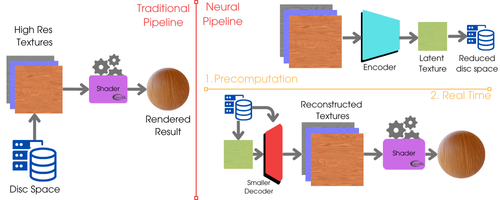
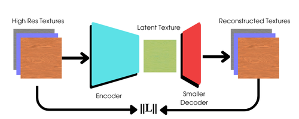

# AutoMat: Learning Compact Material Representations for Real-Time Graphics

## Overview

AutoMat is a research project focused on developing compressed neural representations of physically-based materials for real-time graphics applications. Our goal is to significantly reduce memory storage requirements while maintaining high visual fidelity for applications like video games and real-time rendering.

## Problem Statement

Real-time photorealistic graphics applications face significant challenges when managing high-resolution physically based rendering (PBR) materials. These materials are typically represented as dense texture files that consume substantial memory resources. AutoMat aims to reduce these storage requirements through neural texture compression techniques with real-time decoding capabilities.

## Proposed Approach

Building upon recent work in neural material compression by [Weinreich et al. 2024](https://arxiv.org/2311.16121), we investigate various auto-encoder architectures (VQ-VAE, convolutional, MLP-based, etc.) for texture compression with real-time decompression capabilities.

The key innovation in our approach compared to other auto-encoder methods is that **our decoder is designed to be smaller than the encoder** to enable real-time inference. We carefully measure the trade-offs between compression ratio, reconstruction quality, and inference speed.

## General Pipeline

1. **Data Collection**: Gather diverse PBR material textures from multiple datasets
2. **Preprocessing**: Normalize and prepare textures for training
3. **Training**: Develop and train auto-encoder architectures with compact decoders
4. **Evaluation**: Measure compression ratios, visual quality, and real-time performance
5. **Integration**: Implement real-time decoders in rendering frameworks

## Datasets

We leverage multiple high-quality texture datasets:

* **[HF/texture-color-normal-1k](https://huggingface.co/datasets/dream-textures/textures-color-normal-1k)**: Image dataset of 1000+ color and normal map textures in 512×512 resolution
* **[AmbientCG](https://ambientcg.com/list?type=substance&sort=popular)**: Free and open-source dataset containing hundreds of PBR material texture maps in various resolutions
* **[Disney Research](https://www.disneyanimation.com/resources/moana-island-scene/)**: Moana Island Scene with all assets necessary for rendering

## Inspiration and References

* [Weinreich et al.] Real-Time Neural Materials using Block-Compressed Features, Eurographics 2024, [arXiv:2311.16121](https://arxiv.org/2311.16121)
* [van den Oord et al.] Neural Discrete Representation Learning (VQ-VAE), [arXiv:1711.00937](https://arxiv.org/abs/1711.00937)

## Team

- Vishruth Devan
- Jose Murguia Fuentes
- Maria Gordiyenko
- Stephen Pasch
- Jun Wu

## Results

_Coming soon!_

## License

[MIT License](LICENSE)