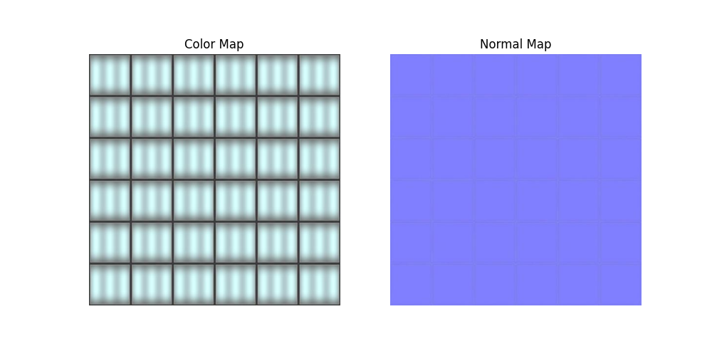
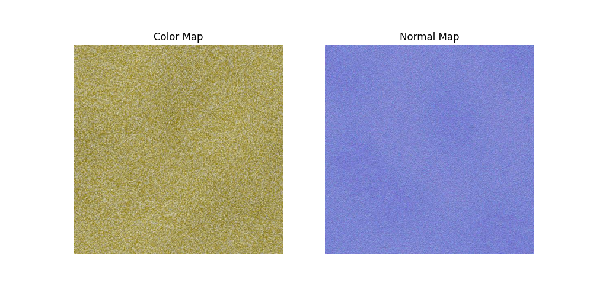

# AutoMat: Learning Compact Material Representations for Real-Time Graphics

## Overview

AutoMat is a research project focused on developing compressed neural representations of physically-based materials for real-time graphics applications. Our goal is to significantly reduce memory storage requirements while maintaining high visual fidelity for applications like video games and real-time rendering.

## Usage Instructions

1. To train the model from scratch, run `python train.py` from the root directory of the project.
2. To evaluate the trained model and view reconstruction results, run `python eval.py`.

## Problem Statement

Real-time photorealistic graphics applications face significant challenges when managing high-resolution physically based rendering (PBR) materials. These materials are typically represented as dense texture files that consume substantial memory resources. AutoMat aims to reduce these storage requirements through neural texture compression techniques with real-time decoding capabilities.

## Proposed Approach

Building upon recent work in neural material compression by [Weinreich et al. 2024](https://arxiv.org/2311.16121), we investigate various auto-encoder architectures (VQ-VAE, convolutional, MLP-based, etc.) for texture compression with real-time decompression capabilities.

The key innovation in our approach compared to other auto-encoder methods is that **our decoder is designed to be smaller than the encoder** to enable real-time inference. We carefully measure the trade-offs between compression ratio, reconstruction quality, and inference speed.

## General Pipeline

1.  **Data Collection**: Gather diverse PBR material textures from multiple datasets
2.  **Preprocessing**: Normalize and prepare textures for training
3.  **Training**: Develop and train auto-encoder architectures with compact decoders
4.  **Evaluation**: Measure compression ratios, visual quality, and real-time performance
5.  **Integration**: Implement real-time decoders in rendering frameworks

## Datasets

We leverage multiple high-quality texture datasets:

- [**HF/texture-color-normal-1k**](https://huggingface.co/datasets/dream-textures/textures-color-normal-1k): Image dataset of 1000+ color and normal map textures in 512×512 resolution
- [**AmbientCG**](https://ambientcg.com/list?type=substance&sort=popular): Free and open-source dataset containing hundreds of PBR material texture maps in various resolutions
- [**Disney Research**](https://www.disneyanimation.com/resources/moana-island-scene/): Moana Island Scene with all assets necessary for rendering

## Inspiration and References

- [Weinreich et al.] Real-Time Neural Materials using Block-Compressed Features, Eurographics 2024, [arXiv:2311.16121](https://arxiv.org/2311.16121)
- [van den Oord et al.] Neural Discrete Representation Learning (VQ-VAE), [arXiv:1711.00937](https://arxiv.org/abs/1711.00937)

## Team

- Vishruth Devan
- Jose Murguia Fuentes
- Maria Gordiyenko
- Stephen Pasch
- Jun Wu

## Exploratory Data Analysis

We start the analysis with the images from Hugging Face

This dataset contains 1,426 color and normal map textures in 512x512 resolution, where color and normal map refers to the following:

- **Color Map**: Texture that defines the base color of a 3D model. This is how a surface looks under neutral lighting conditions
- **Normal Map**: Texture that simulates surface details without adding extra geometry. Surface normals depict how to reflect light

Here are some examples of the the images on the dataset

  

Since we are working with images one way to analyze them is to understand the distribution of their pixel value by channel (RGB)

For this purpose we analyze the complete data set and calculate the average pixel value by channel and plot its distribution both for color and normal map

 

If we observe the color map we notice that for all channels the average pixel value has a somewhat triangular shape whereas in the normal map blue channel is right-skewed and high frequency is observed around 130 in red and green channels

We have information as well regarding texture types, so let's analyze its frequency

The highest frequency is observed on:

- Paving stones
- Tiles
- Bricks
- Wood
- Fabric

With this categories let's review whether clusters appear naturally with the average pixel value for the most frequent texture types (top 10)

 

They follow the same pattern as we previously observed on the global distribution. It seems that no distinguishable cluster appears on this dataset by pixel value

## Results

_Coming soon!_

## License

[MIT License](LICENSE)
