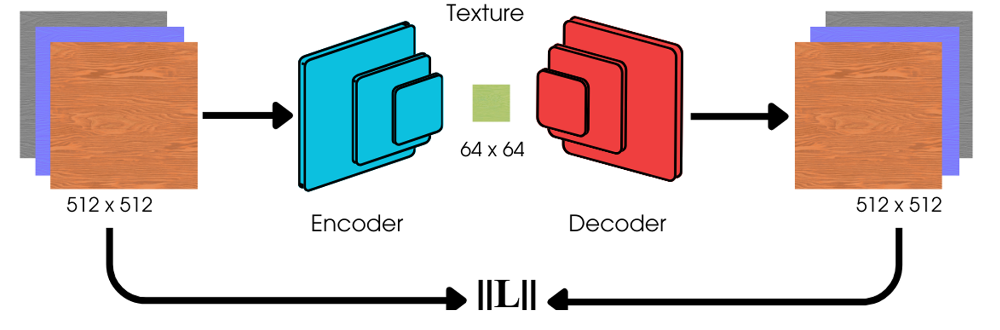

# AutoMat: Learning Compact Material Representations for Real-Time Graphics

## Overview

Modern video games and real-time photorealistic graphics applications demand photorealistic rendering using high-resolution physically based rendering (PBR) materials. These materials—color, normal, roughness maps—occupy significant storage and VRAM. This project introduces a neural texture compression framework using convolutional autoencoders, achieving a **4× compression ratio** with minimal perceptual degradation, optimized for real-time performance.
 
## Usage Instructions

1. To train the model from scratch, run `python train.py` from the root directory of the project.
2. To evaluate the trained model and view reconstruction results, run `python eval.py`.

## Problem Statement

Traditional texture formats (e.g., JPEG, PNG) reduce storage size but are not optimized for GPU pipeline integration. As games scale up to 4K and beyond, storing and accessing uncompressed multi-channel textures becomes a bottleneck. This project explores **learned latent representations** for texture data that can be decoded efficiently either on load or at runtime.

## Proposed Approach

Building upon recent work in neural material compression by [Weinreich et al. 2024](https://arxiv.org/2311.16121), we investigate various auto-encoder architectures (VQ-VAE, convolutional, MLP-based, etc.) for texture compression with real-time decompression capabilities.

The key innovation in our approach compared to other auto-encoder methods is that **our decoder is designed to be smaller than the encoder** to enable real-time inference. We carefully measure the trade-offs between compression ratio, reconstruction quality, and inference speed.

### Inference Modes

We evaluate two neural decoding modes:

| Mode               | VRAM Usage     | Compute Overhead   | Description |
|--------------------|----------------|---------------------|-------------|
| **Inference-on-Load** | High (decoded texture stored) | Low (decode once) | Decode once, use like normal texture |
| **Inference-on-Sample** | Low (latent only) | High (decode every frame) | Runtime shader-based neural decoding |

> This implementation uses the **inference-on-load** strategy.

### Architecture

Our model is a symmetric **convolutional autoencoder**:

- **Encoder**: 3 × Conv + ReLU + MaxPooling
- **Bottleneck**: Fully connected latent layer (dim = 128)
- **Decoder**: Transposed convolutions + upsampling

This architecture significantly reduces the number of parameters compared to fully connected networks, while preserving essential visual structures.

## 🛠Training Details

- **Dataset**: [HuggingFace: dream-textures/color-normal-1k](https://huggingface.co/datasets/dream-textures/textures-color-normal-1k)
- **Image Resolution**: 512 × 512
- **Channels**: RGB + Normal maps
- **Batch Size**: 16
- **Learning Rate**: 0.001
- **Latent Dimension**: 128

### Hybrid Loss Function

Weighted composite loss:
- `0.75 × L1`
- `0.20 × MSE`
- `0.05 × MS-SSIM`
- `0.00 × SSIM`

> This combination balances pixel accuracy and perceptual structure.

## Loss Curve

Training loss across 50 epochs shows stable convergence:

## Results

Color and normal maps are reconstructed with high perceptual fidelity:

> Achieved ~4× compression with PSNR > 30 and perceptually stable SSIM scores.

## Inspiration and References

- [Weinreich et al.] Real-Time Neural Materials using Block-Compressed Features, Eurographics 2024, [arXiv:2311.16121](https://arxiv.org/2311.16121)
- [van den Oord et al.] Neural Discrete Representation Learning (VQ-VAE), [arXiv:1711.00937](https://arxiv.org/abs/1711.00937)

## Team

- Vishruth Devan
- Jose Murguia Fuentes
- Maria Gordiyenko
- Stephen Pasch
- Jun Wu

## Exploratory Data Analysis

We start the analysis with the images from Hugging Face

This dataset contains 1,426 color and normal map textures in 512x512 resolution, where color and normal map refers to the following:

- **Color Map**: Texture that defines the base color of a 3D model. This is how a surface looks under neutral lighting conditions
- **Normal Map**: Texture that simulates surface details without adding extra geometry. Surface normals depict how to reflect light

Here are some examples of the the images on the dataset

  

Since we are working with images one way to analyze them is to understand the distribution of their pixel value by channel (RGB)

For this purpose we analyze the complete data set and calculate the average pixel value by channel and plot its distribution both for color and normal map

 

If we observe the color map we notice that for all channels the average pixel value has a somewhat triangular shape whereas in the normal map blue channel is right-skewed and high frequency is observed around 130 in red and green channels

We have information as well regarding texture types, so let's analyze its frequency

The highest frequency is observed on:

- Paving stones
- Tiles
- Bricks
- Wood
- Fabric

With this categories let's review whether clusters appear naturally with the average pixel value for the most frequent texture types (top 10)

 

They follow the same pattern as we previously observed on the global distribution. It seems that no distinguishable cluster appears on this dataset by pixel value

## Results

_Coming soon!_

## License

[MIT License](LICENSE)
